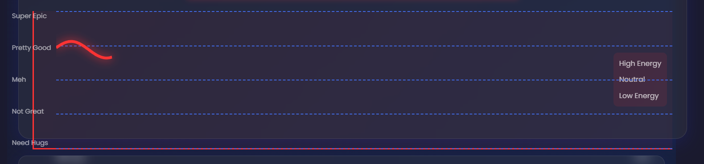
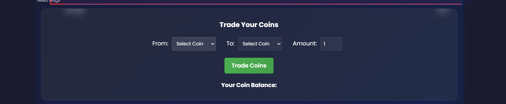

# EmotiCoin Trading 🎯

## Basic Details
### Team Name: ANAGHA A

### Team Members
- Team Lead: ANAGHA A - [CUCEK]

### Project Description
 EmotiCoin Trading — Turn Your Feelings into Fortune
EmotiCoin is a playful emotion-based currency where your mood becomes your market power. Every time you share how you feel — happy, sad, excited, or even “meh” — you earn unique EmotiCoins. These coins can be “traded” in a fun, non-serious marketplace of virtual rewards, silly perks, or bragging rights. The happier or rarer the mood, the more valuable the coin! In this emotional economy, the best traders aren’t stock brokers — they’re mood makers.

### The Problem (that doesn't exist)
People’s moods go to waste every day without ever earning them anything.
EmotiCoin turns your random feelings into a ridiculous currency you can brag about.

### The Solution (that nobody asked for)
By creating the world’s first mood-powered coin generator — type your feelings, get fake money, and watch animated coins rain down like you just won the lottery of emotions.

## Technical Details
### Technologies/Components Used
For Software:
Languages used:

JavaScript (React for frontend, Node.js for backend)

HTML, CSS

Frameworks used:

Express.js (backend routing)

React.js (frontend UI)

Libraries used:

Axios (API requests)

Framer Motion (coin animations)

dotenv (environment variables)

cors (cross-origin requests)

Tools used:

Git & GitHub (version control)

VS Code (code editor)

Node.js & npm (package management)

### Implementation
For Software:
# Installation

# 1. Clone the repository
git clone https://github.com/ANAGHA-A-04/emoticoin.git

# 2. Go into the project folder
cd emoticoin

# 3. Install dependencies for the backend
cd server
npm install

# 4. Install dependencies for the frontend
cd ../client
npm install

# Run

# Start the backend server
cd server
npm start

# In another terminal, start the frontend
cd client
npm run dev

### Project Documentation
For Software:

# Screenshots (Add at least 3)

Input the user feeling 

Here you see your life status

Trade our emotions 

### Project Demo
# Video
[video](https://github.com/user-attachments/assets/bdd8317f-18a9-4083-a86f-d0e09ec69664)

---
Made with ❤️ at TinkerHub Useless Projects 

